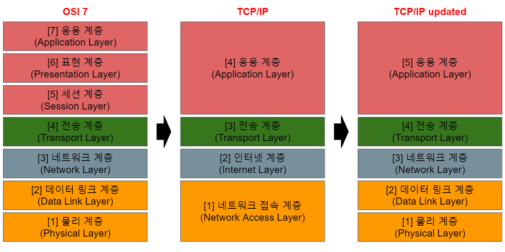

<h2>OSI 7 Layer</h2>

 

<h3>응용 계층(Application Layer)</h3>

- 애플리케이션 계층은 응용 프로세스를 직접 사용하여 직접적인 응용 서비스를 수행하는 계층
- FTP, HTTP, SMTP, Telnet

 

<h3>표현 계층(Presentation Layer)</h3>

- 데이터의 변환, 데이터의 압축, 데이터 암호화가 이루어짐
- 서로 다른 통신 기기 간에 다른 인코딩을 사용할 수도 있음 -> 해당 계층에서 데이터 변환이 일어남

 

<h3>세션 계층(Session Layer)</h3>

- 세션을 열고 닫고를 제공하는 메커니즘의 계층
- 세션 복구도 지원
- 세션 도커는 체크포인트라는 것을 통해 동기화를 시켜줌

    

    - 100MB 데이터를 B에게 전송, 5MB마다 체크포인트 설정
    - 48MB 전송 도중 연결이 끊김 -> 체크포인트 덕분에 45MB 지점부터 세션을 이어갈 수 있음

 

<h3>전송 계층(Transport Layer)</h3>

- 서로 다른 두 네트워크 간의 전송을 담당
- 세그멘테이션, 흐름제어, 오류제어 등을 제공
    - 세그멘테이션: 상위 계층 데이터를 받아서 세그먼트라는 단위로 나누는 것을 의미

        

    - 흐름제어: 서로 다른 데이터전송량이 다른 기기에서 우측이 초당 10MB를 처리할 수 있는 기기에 초당 50MB를 보내게 될 경우 전송량을 낮춰달라 요구하고 전송량을 낮추는 방식

        

        

     - 오류제어: 보낸 데이터가 정확히 오류 손실이 없는지 오류가 있다면 다시 해당 데이터를 보내줌

 

<h3>네트워크 계층(Network Layer)</h3>

- IP나 라우터 장비가 속한 계층
- 서로 다른 두 네트워크간의 데이터 전송 담당
    - **라우팅**: 호스트에다가 IP 번호를 부여하고 해당 도착지 IP까지 최적의 경로를 찾아주는 기능 제공

 

<h3>데이터링크 계층(Data Link Layer)</h3>

- 동일한 네트워크 내에서 데이터 전송 담당
- 데이터 단위: Frame

- 오류제어와 흐름제어 제공
    - 데이터링크 내에서의 오류제어: 오류가 난 프레임을 버려버림
    - 트랜스포트 내에서의 오류제어: 데이터가 없으면 데이터를 다시 보내줌(오류 복구)

 

<h3>물리 계층(Physical Layer)</h3>

- 비트 단위를 전기 신호로 변환해줌