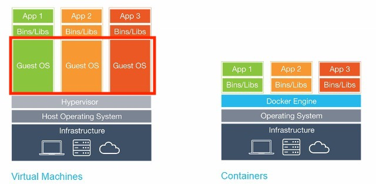

<h2>docker</h2>

- 가상의 공간을 만들어서 호스트OS와는 별개의 환경에서 프로세스가 동작하는 기술

- 가상의 공간을 이미지로 만들어 저장 -> n개의 컨테이너 생성 가능(각각 독립된 가상의 공간에서 실행됨)
    - 도커 이미지는 Dockerfile이라는 파일로 관리

<br>

- 호스트OS의 포트 - 컨테이너의 포트 연결만 하면 동작 가능
- 도커는 리눅스 컨테이너 기술 -> Mac, Window인 경우 가상머신에 설치됨
    - docker for mac은 xhyve라는 macOS에서 제공하는 가상환경을 이용
    - docker for windows는 Hyper-V기능을 이용

<br><br>

<h2>docker container</h2>

- application, system tools, dependencies등을 도커 컨테이너를 통해 하나로 묶은 뒤 windows, MacOS, Linux 등에서 쉽게 배포하고 안정적으로 구동할 수 있도록 도와주는 툴  

- node project의 경우 node.js, npm, dependencies, configs등 다양한 파일이 있는데 이걸 서버마다 설치, 설정하는 것은 문제가 많이 발생함
<br>
- docker container에 애플리케이션 구동에 필요한 모든 파일을 담아두면 어떤 피씨에서도 동일하게 구동 가능, 번거로움 해결 가능

<br><br>

<h2>docker와 vmware의 차이</h2>



- 가장 큰 차이점: 
    - docker에서는 container engine(docker engine)이 설치되어있음 (Host OS 내에 설치)
    - **vmware의 virtual machine에는 guest OS 존재, docker의 container에는 guest OS 존재 X**

<br>

<h3>vmware</h3>

- 하드웨어 위에 vmware, virtualBox 등의 가상머신을 설치

- 한 운영체제 위해서 동일 애플리케이션을 각각의 고립된 다른 환경에서 구동하기 위해선 virtual machine을 통해 애플리케이션을 구동해야 했음.

- Mac 위에서 가상머신 이용시 window, linux 사용가능

- 하지만 운영체제를 포함하고 있기 때문에 굉장히 무겁고 리소스를 많이 잡아먹음 <br>

<br>

<h3>container</h3>

- 하드웨어에 설치된 OS에(Host OS) container engine만 설치하면 개별적인 컨테이너를 만들어서 개별적인 애플리케이션을 구동할 수 있게 해줌

- container은 운영체제를 포함하지 않고 **container engine**이 설치된 host os를 공유
    - container engine이 host os에 접근해서 필요한 것들을 처리해줌
    - container engine 중 가장 많이 쓰이는 것이 **docker engine**

- 운영체제와 커널과 관련됨

- container를 만들기 위해서 필요한 준비물 3가지
    - Dockerfile
    - Image(Dockerfile를 통해 생성)
    - Container(Image를 통해 구동 가능)

<br>

<h3>Dockerfile</h3>

- 설명서, 레시피 같은 것

- 애플리케이션 구동 위해 꼭 필요한 파일은 무엇인지

- 어떤 프레임워크나 라이브러리를 설치해야 하는지 외부 dependencies

- 환경변수 설정

- 어떻게 구동해야 하는지 스크립트 설정

<br>

<h3>Image</h3>

- 애플리케이션을 실행하는데 필요한 코드, 런타임 환경, 시스템 툴, 시스템 라이브러리 등 모든 툴 포함

- 변경이 불가한 불변의 상태

<br>

<h3>Container</h3>

- image를 통해 개별적이고 고립된 환경에서 실행할 수 있음

- 컨테이너 안에서 애플리케이션이 동작할 수 있음

- 하나의 image를 통해 여러 컨테이너 가동할 수 있다

- image = class, 각각의 container = instance

<br><br>

<h2>Container 배포</h2>

- 어떻게 이미지를 공유할 수 있나?!

- 깃허브 같은 container registry에 로컬에 저장된 image를 푸시 -> 다른 서버에서 해당 이미지를 pull 받아서 실행

    - 실행하기 위해서는 docker와 같은 컨테이너 엔진 설치 필수

- 이미지 공유 가능한 registry
    - public: dockerhub, redhat quay.io, github packages
    - private: aws, google cloud, microsoft azure

- 총 정리

    1. 로컬 머신과 서버에 각각 도커 설치
    2. 로컬 머신에서 Dockerfile 작성 -> Dockerfile통해 image 생성
    3. 만들어진 image를 container registry에 push
    4. 서버에서 이미지를 pull 받음
    5. run


<br>

<h2>실습</h2>

<h3>Dockerfile</h3>

```Dockerfile
FROM node:16-alpine

WORKDIR /app

COPY package.json package-lock.json ./

RUN npm ci

COPY index.js .

ENTRYPOINT [ "node", "index.js" ]
```

<br>


<h3>docker build -f Dockerfile -t fun-docker .</h3>

```
...

 => [1/5] FROM docker.io/library/
 => [2/5] WORKDIR /app                                                     0.1s
 => [3/5] COPY package.json package-lock.json ./                           0.0s
 => [4/5] RUN npm ci                                                       0.9s
 => [5/5] COPY index.js .                                                  0.0s
 => exporting to image                                                     0.1s
 => => exporting layers                                                    0.1s
 => => writing image sha256:fd017f7e75c93116faff0fa8cc797b134aace501cfa49  0.0s
 => => naming to docker.io/library/fun-docker                              0.0s

...

chaewon@gimchaewon-ui-MacBookAir-2 docker % docker images
REPOSITORY   TAG       IMAGE ID       CREATED          SIZE
fun-docker   latest    fd017f7e75c9   15 seconds ago   119MB
```

<br>

```
docker run -d -p 8090:8080 fun-docker
```
- -d : detached -> 백그라운드가 동작해야 하는데 그러면 터미널이 계속 기다려야 하므로 터미널한테 하던 일 하라고 전달해줌
- -p 8090:8080 : 포트지정 -> 호스트머신포트:컨테이너포트


<br>

<h3>docker ps</h3>

```

CONTAINER ID   IMAGE        COMMAND           CREATED          STATUS          PORTS                    NAMES
ebe4d0957a37   fun-docker   "node index.js"   38 seconds ago   Up 37 seconds   0.0.0.0:8090->8080/tcp   eloquent_dubinsky
```
- 실행중인 도커 확인

<br>

<h3>docker images</h3>

```
REPOSITORY   TAG       IMAGE ID       CREATED         SIZE
fun-docker   latest    fd017f7e75c9   7 minutes ago   119MB
```

<br>

<h3>docker hub login</h3>

```
docker login -u ID
```
- ID에는 도커허브 가입한 아이디 입력

<br>

<h3>도커 허브에 해당 이미지 푸시</h3>

```
docker push ID/docker-exa
mple:latest
```