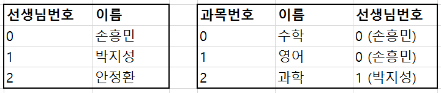

<h2>관계형 데이터베이스</h2>

엑셀처럼 행과 열로 데이터를 저장할 수 있는 데이터베이스

<h3>특징</h3>

- 거의 모든 곳에 사용 가능

- 구조화된 데이터를 저장하기에 적합

- 보통 SQL이라는 언어를 이용해 데이터 입출력

- 스키마를 미리 정의 -> 관리가 쉬움

- 구조화된 데이터 -> 데이터 불러오기도 간편

- 트랜잭션, 롤백 이런 기능을 이용해 데이터의 무결성을 보존 -> 금융, 거래 서비스에 필수

 

<h3>관계형(relational)의 의미</h3>

데이터들 간의 관계를 정해서 데이터 저장 가능

관계의 종류 : one to one, one to many, many to many 

 

<h2>NoSQL 데이터베이스</h2>

SQL문없이도 사용할 수 있는 데이터베이스

테이블에 국한되지 않고 자유로운 형식으로 데이터를 쉽게 분산저장

 

<h3>종류</h3>

- Key-value 모델: Object, JSON 자료형 형식으로 데이터를 쉽게쉽게 저장, 출력이 가능. 가장 심플함

- Document 모델: 테이블 대신 Collection이라는 문서 기반으로 데이터를 분류하고 저장. 테이블보다는 훨씬 유연. 
(MongoDB: Key-value, Document 모델 저장방식)

- Graph 모델 : 데이터를 노드의 형태로 저장하고 노드간의 흐름 또는 관계를 저장

- Wide-column 모델 : 한 행마다 각각 다른 수, 다른 종류의 열을 가질 수 있음. (스키마가 자유로움) 

 

<h3>특징</h3>

1. Scaling이 쉽다

    - 찰나의 순간에 대량의 데이터를 저장? 

    - 기존 관계형 데이터베이스는 확장이 매우 어려움. 보통 scale up 이라는 방법으로 서버의 성능을 키워야 함.

    - 하지만 대부분의 NoSQL 데이터베이스는 scale out이라는 방법으로 데이터를 분산저장하는 걸 기본적으로 지원. 
    -> 확장 걱정할 필요없이 쉽게 쉽게 데이터 입출력에만 신경쓰면 됨

    - 그래서 대량의 데이터를 빠르게 입출력해야한다면 NoSQL이 제격(관계형 데이터베이스도 요즘은 분산저장 지원 잘함)

 

2. 대부분 다루기가 쉽습니다. 

    - SQL 이라는 언어를 새로 배우지 않아도 데이터를 쉽게 입출력

    - 자바스크립트 object{} 자료형 다루듯이 데이터를 입출력 -> 매우 편리

    - 그리고 여러분이 서버에서 쓰던 프로그래밍 언어로 DB를 다룰 수 있다

 

3. 대부분 스키마 정의 없이도 쉽게 쓸 수 있습니다. 

    - 이 열의 데이터는 정수입니다~ 라고 표현 안 해도 됨

    - 장점이자 단점일 수 있다. 그래서 MongoDB에선 스키마를 미리 정의하기 위한 Mongoose같은 라이브러리를 추가해서 사용하기도 함.

 

4.  NoSQL 데이터베이스는 기본적으로 SQL에서의 JOIN 연산을 적용하는게 기본적으로 어렵습니다. 

    - 서버 단에서 JOIN 연산을 쉽게 처리해주는 라이브러리를 이용

 

<h3>차이점</h3>

- 정규화된 데이터와 안정성이 필요하다면 관계형 데이터베이스를 사용

- 금융서비스를 만든다, 은행 전산시스템을 만든다면 당연히 안정적인 관계형이 최고

- 뭔가 서비스의 변경사항이 잦아서 쉽고 유연하게 데이터를 저장하고 싶으면 NoSQL을 사용 

- 하지만 일초에 수백만개의 데이터 입출력 요청이들어오는 SNS 서비스를 만들 때 사용

- 실제로 Facebook은 이런 대량의 데이터를 저장하기 위해 HBase 데이터베이스를 이용해 분산저장