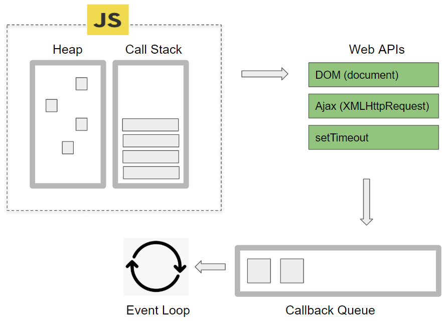
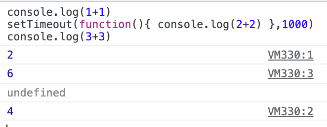

<h2>Node.js</h2>
크롬의 자바스크립트 해석 엔진이 분리되어 살을 붙여 분리됨

브라우저 내에서 말고도 다른 환경에서도 자바스크립트를 실행할 수 있도록 도와주는 것

= 자바스크립트 실행 환경(=런타임)

브라우저 안 켜도 Node.js만 있으면 터미널에서도 자바스크립트 실행 가능

Node.js로 서버 만들기도 가능 -> Non-blocking I/O 때문

<br>

<h3>Node.js 특징</h3>
- Event-driven <br>
- Non-blocking I/O

    - 요청 여러 개가 들어옴
        - 1) 티켓 1장
        - 2) 티켓 2장
        - 3) 티켓 100장
        - 4) 티켓 1장
    - 일반 서버
        - 일반 서버는 들어온 요청 순서대로 처리하기 때문에 요청4는 엄청 오래 대기할 수 밖에 없음
    - Node.js 서버
        - 노드 서버는 접수를 다 받은 후 빨리 완료될 수 있는 것부터 처리함
        - 1 -> 2 -> 4 -> 3 순서
        - 이렇게 처리할 수 있는 원리는 Event Loop 때문
        - Non-blocking 덕분에 채팅/SNS에서 자주 사용

- 일반 서버도 서버 스케일링 혹은 멀티쓰레딩을 통해 동시 요청 처리 가능
    - Scale Up: 서버를 점점 크게 만듦
    - Scale Out: 일정 규모의 서버를 n개 설치


<br>

<h2>자바스크립트 실행 원리</h2>



- stack: 코드를 스택에 넣고 한줄한줄 실행함
    - 특징: 하나만 있어서 코드 한줄씩만 실행가능 -> **싱글 스레드**
    - ```console.log(i)```
        - i가 어딨지?!?! -> heap에서 찾음
    - ``` setTimeout(function() { console.log(2+2) }, 1000) ```
        - 얘는 1초 뒤에 실행되니까 stack말고 대기실에 보내버림
    - ajax, setTimeout, eventListener 같은 기다림이 필요한 코드들은 대기실로 보내짐
        - 실행할 때 queue에 보내져서 대기 끝난 코드들을 줄세운 후에 하나씩 stack으로 옮겨감
    - stack은 바빠서 이렇게 queue에서 올려보내지는 것임
    - **stack이 비어있을 때만 queue -> stack 이동 가능**

    
    - 자바스크립트는 코드를 어떻게 적든 빠르게 실행할 수 있는 것부터 실행함
        - 병렬 처리
    - ex. 10초 걸리는 어려운 연산을 stack에서 실행 중
        - 연산이 완료될 때까지 이벤트리스너, ajax 등 처리 불가
- heap: 변수들을 저장 = 메모리
    - ``` i = {age:20} ```
    - ``` i = {name:'kim'} ```
- web apis: dom, ajax, setTimeout등 브라우저가 제공하는 api

<br>


